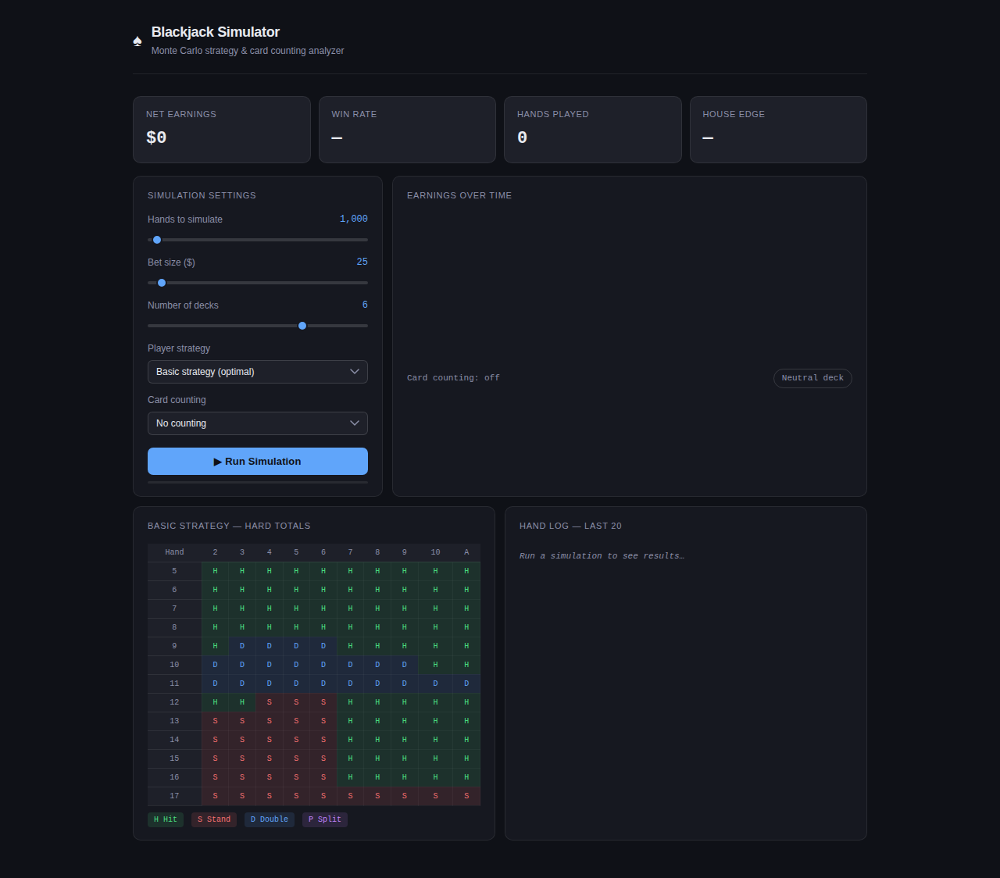
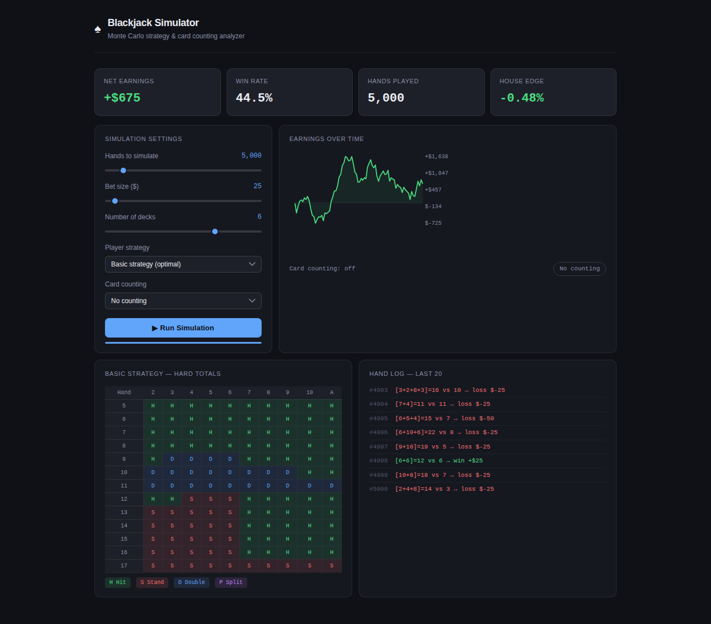
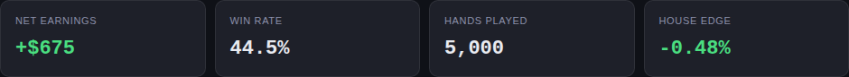
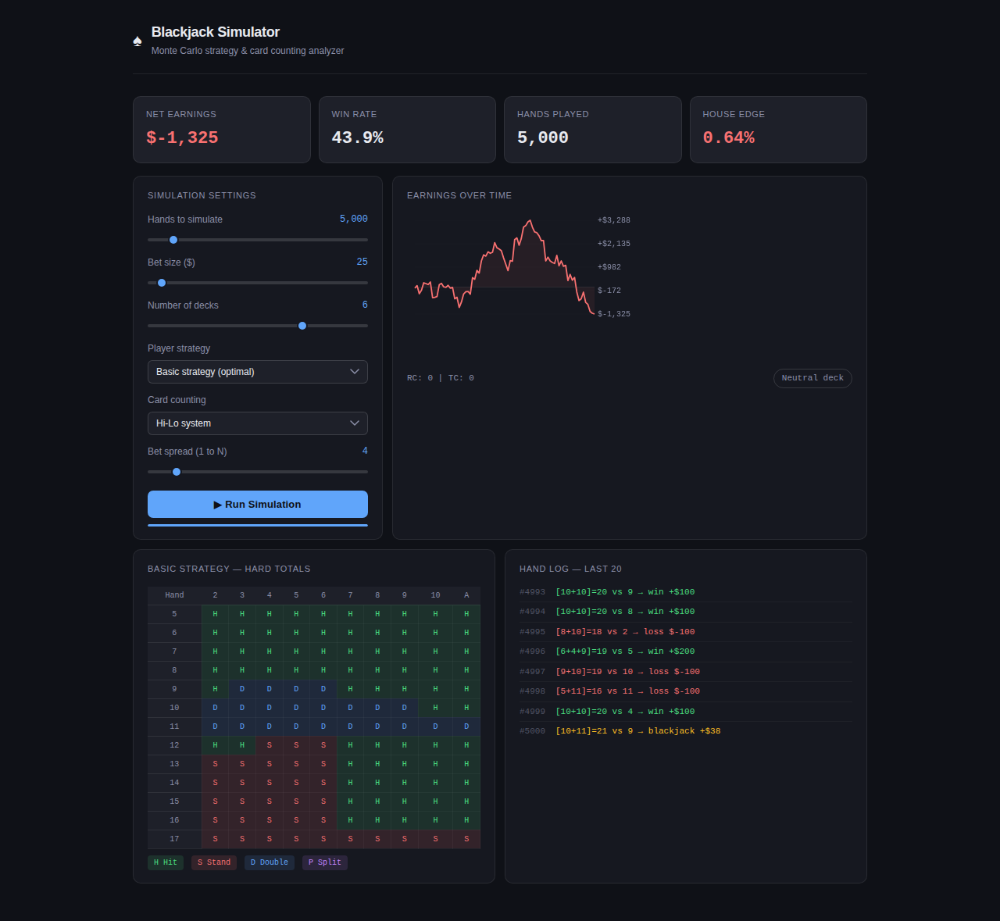
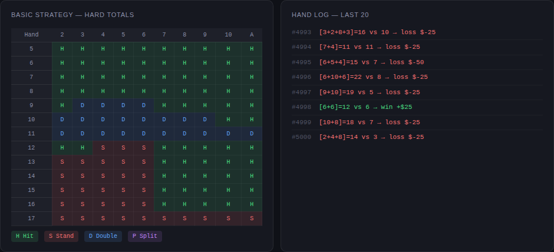

# ♠ Blackjack Simulator

> Monte Carlo blackjack engine with a browser-based UI, full basic strategy tables, and 6 card counting systems.

[](https://github.com/VijayKumaro7/blackjack-simulator/actions)
[](https://www.python.org/)
[](LICENSE)
[](tests/)

---

## Interactive UI

Open `blackjack_simulator_ui.html` directly in any browser — no install, no server needed.

### Dashboard — initial state



---

### After running 5,000 hands — basic strategy

Stat cards update in real time. The earnings chart renders as the simulation completes.



---

### Stat cards close-up

Net earnings, win rate, hands played, and house edge — colour-coded green (player advantage) or red (house advantage).



---

### Hi-Lo card counting — 1–4 bet spread

Enable **Hi-Lo system** and set a bet spread. The simulator automatically raises bets when the true count is favorable. The badge and running/true count display update after each run.



---

### Strategy table and hand log

The full hard-total basic strategy table is always visible. The hand log shows the last 20 hands with card totals, dealer up-card, outcome, and P&L — wins in green, blackjacks in gold, losses in red.



---

## Features

- **~100,000 hands/sec** — 50,000-hand simulation finishes in under a second
- **Full basic strategy** — hard totals, soft totals, pair splitting, Illustrious 18 index deviations
- **5 player strategies** — basic, always-17, mimic dealer, never-bust, random
- **6 card counting systems** — Hi-Lo, KO, Hi-Opt I, Omega II, Zen Count
- **Bet spread sizing** — auto-scales bets from 1× to N× based on true count
- **Earnings chart** — live line chart with green/red fill under the curve
- **Hand log** — last 20 hands with full detail
- **CLI tool** — `python main.py` with `--compare-strategies` and `--compare-counts` modes
- **39 pytest tests** — strategy tables, counting math, simulation correctness
- **GitHub Actions CI** — runs on Python 3.10, 3.11, 3.12

---

## Quick start

### Browser UI (no install)

```bash
git clone https://github.com/VijayKumaro7/blackjack-simulator.git
cd blackjack-simulator
open blackjack_simulator_ui.html   # macOS
# or just double-click the file in Windows / Linux
```

### Python CLI

```bash
# Basic run — 10,000 hands
python main.py --hands 10000 --strategy basic

# With Hi-Lo counting and 1–4 bet spread
python main.py --hands 20000 --strategy basic --count hilow --spread 4

# Compare all 5 strategies side-by-side
python main.py --compare-strategies --hands 30000

# Compare all 6 counting systems
python main.py --compare-counts --hands 30000
```

### Python API

```python
from blackjack import run_simulation, Strategy, CountingSystem

stats = run_simulation(
    num_hands=50_000,
    base_bet=25,
    num_decks=6,
    strategy=Strategy.BASIC,
    counting_system=CountingSystem.HILOW,
    bet_spread=4,
)

print(stats.summary())
# {
#   'hands': 50000, 'wins': 21847, 'losses': 24610, 'pushes': 3543,
#   'blackjacks': 2381, 'net_earnings': -842.5,
#   'total_wagered': 1412500.0, 'win_rate': 43.6, 'house_edge': 0.0596
# }
```

---

## Project structure

```
blackjack-simulator/
├── blackjack_simulator_ui.html   ← Standalone browser UI (open directly)
├── blackjack/
│   ├── __init__.py               ← Public API
│   ├── simulator.py              ← Core engine: shoe, hand play, settlement
│   ├── strategy.py               ← Hard/soft/pair tables + Illustrious 18
│   └── counting.py               ← Hi-Lo, KO, Hi-Opt I, Omega II, Zen Count
├── tests/
│   └── test_blackjack.py         ← 39 pytest tests
├── notebooks/
│   └── analysis.ipynb            ← Earnings plots, Monte Carlo distributions
├── docs/screenshots/             ← README screenshots
├── main.py                       ← CLI entry point
├── requirements.txt
└── setup.py
```

---

## CLI flags

| Flag | Default | Description |
|------|---------|-------------|
| `--hands` | 10000 | Number of hands to simulate |
| `--bet` | 25 | Base bet in dollars |
| `--decks` | 6 | Number of decks (1–8) |
| `--strategy` | basic | `basic` / `always17` / `mimic` / `never_bust` / `random` |
| `--count` | none | `none` / `hilow` / `ko` / `hiopt1` / `omega2` / `zen` |
| `--spread` | 4 | Bet spread multiplier (1 to N) |
| `--verbose` | off | Print every hand result |
| `--compare-strategies` | — | Benchmark all 5 strategies |
| `--compare-counts` | — | Benchmark all 6 counting systems |

---

## Strategies

| Strategy | Description | Typical house edge |
|----------|-------------|-------------------|
| **Basic** | Mathematically optimal for every hand | ~0.5–1% |
| **Always 17+** | Stand on hard 17+, hit otherwise | ~2–3% |
| **Mimic dealer** | Follow dealer rules, no splits/doubles | ~5–6% |
| **Never bust** | Stand on any 12+ | ~3–4% |
| **Random** | 50/50 hit or stand | ~8–10% |

---

## Card counting systems

| System | Type | Level |
|--------|------|-------|
| Hi-Lo | Balanced | 1 |
| KO | Unbalanced | 1 |
| Hi-Opt I | Balanced | 1 |
| Omega II | Balanced | 2 |
| Zen Count | Balanced | 2 |

---

## Running tests

```bash
pip install pytest pytest-cov
pytest tests/ -v --cov=blackjack
# 39 passed in 1.09s
```

---

## License

MIT — see [LICENSE](LICENSE).

---

## Author

**VijayKumaro7** · [GitHub](https://github.com/VijayKumaro7) · [LinkedIn](https://linkedin.com/in/vijay-kumar) · [Blog](https://hashnode.com/@VijayKumaro7)
