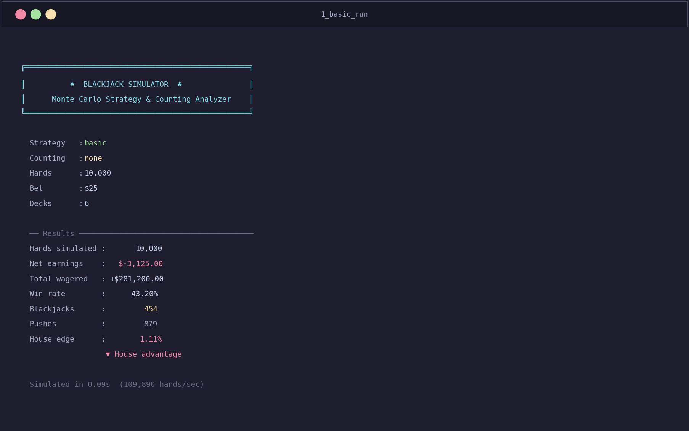
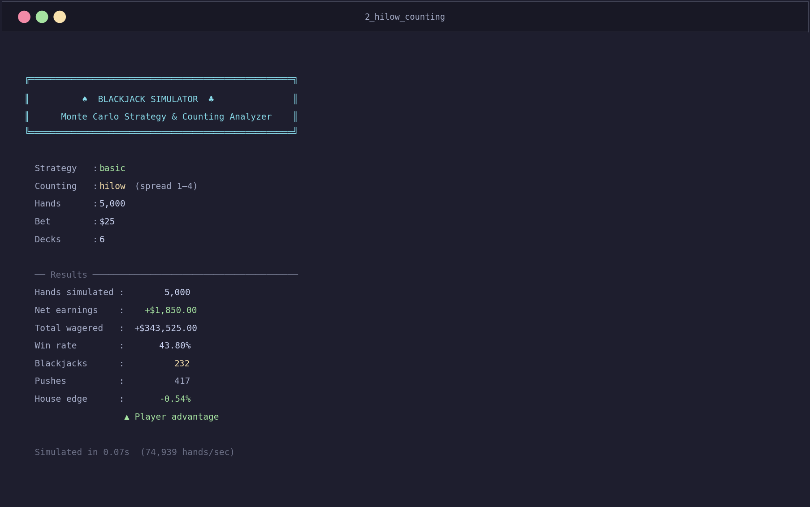
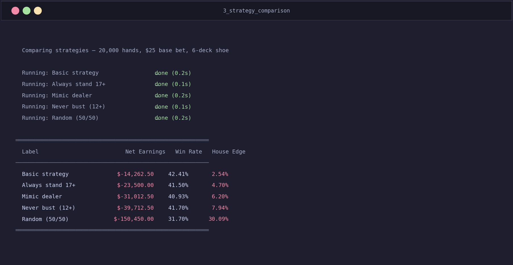
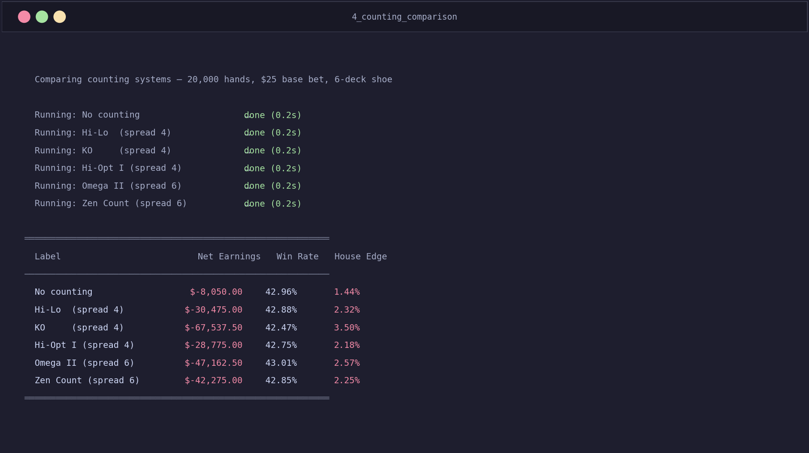
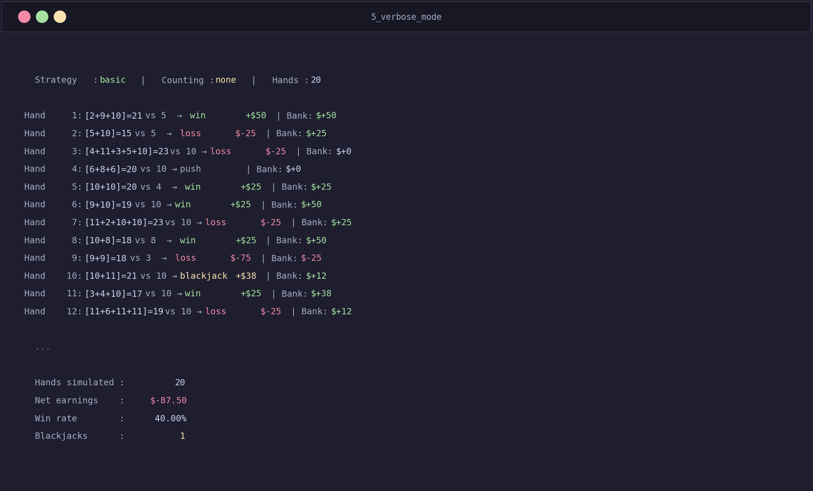
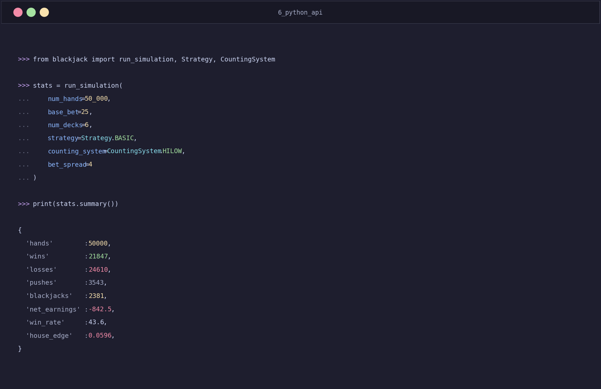

# ♠ Blackjack Simulator

> Monte Carlo blackjack engine with full basic strategy, card counting systems, and CLI analysis tools.

[](https://github.com/VijayKumaro7/blackjack-simulator/actions)
[](https://www.python.org/)
[](LICENSE)
[](tests/)

---

## Features

- **Simulate thousands of hands** in milliseconds — ~100,000 hands/sec on a standard machine
- **Mathematically optimal basic strategy** — full hard/soft/pair decision tables
- **5 player strategies** for comparison (basic, always-17, mimic dealer, never-bust, random)
- **6 card counting systems** — Hi-Lo, KO, Hi-Opt I, Omega II, Zen Count
- **Bet spread sizing** — automatically raise bets when the count is favorable
- **Illustrious 18 index plays** — strategy deviations based on true count
- **Strategy & counting comparison mode** — benchmark everything in one command
- **Jupyter analysis notebook** — earnings plots, Monte Carlo distributions, spread sensitivity
- **39-test suite** covering strategy tables, counting math, and simulation correctness

---

## Screenshots

### Basic run — 10,000 hands, basic strategy

```bash
python main.py --hands 10000 --strategy basic
```



---

### Hi-Lo card counting with 1–4 bet spread

```bash
python main.py --hands 5000 --strategy basic --count hilow --spread 4
```



---

### Strategy comparison — all 5 strategies benchmarked

```bash
python main.py --compare-strategies --hands 20000
```



---

### Counting system comparison — all 6 systems benchmarked

```bash
python main.py --compare-counts --hands 20000
```



---

### Verbose mode — hand-by-hand log

```bash
python main.py --hands 20 --strategy basic --verbose
```



---

### Python API

```python
from blackjack import run_simulation, Strategy, CountingSystem
stats = run_simulation(num_hands=50_000, strategy=Strategy.BASIC,
                       counting_system=CountingSystem.HILOW, bet_spread=4)
print(stats.summary())
```



---

## Quick start

```bash
# Clone
git clone https://github.com/VijayKumaro7/blackjack-simulator.git
cd blackjack-simulator

# No external dependencies for core simulation!
python main.py --hands 10000 --strategy basic --count hilow --spread 4
```

---

## Project structure

```
blackjack-simulator/
├── blackjack/
│   ├── __init__.py       # Public API
│   ├── simulator.py      # Core simulation engine (shoe, hand play, settlement)
│   ├── strategy.py       # Decision tables: hard, soft, pair splits + Illustrious 18
│   └── counting.py       # Hi-Lo, KO, Hi-Opt I, Omega II, Zen Count systems
├── tests/
│   └── test_blackjack.py # 39 pytest tests
├── notebooks/
│   └── analysis.ipynb    # Earnings plots, Monte Carlo distributions
├── docs/
│   └── screenshots/      # README screenshots
├── scripts/
│   └── gen_screenshots.py
├── main.py               # CLI entry point
├── requirements.txt
└── setup.py
```

---

## CLI usage

```bash
# Basic run — 10,000 hands, basic strategy, $25 bet, 6 decks
python main.py

# With Hi-Lo card counting and 1–4 bet spread
python main.py --hands 20000 --strategy basic --count hilow --spread 4

# Compare all strategies side-by-side
python main.py --compare-strategies --hands 30000

# Compare all counting systems
python main.py --compare-counts --hands 30000

# Single deck, high stakes
python main.py --hands 50000 --decks 1 --bet 100

# Verbose — print every hand result
python main.py --hands 50 --verbose

# Full help
python main.py --help
```

### CLI flags

| Flag | Default | Description |
|------|---------|-------------|
| `--hands` | 10000 | Number of hands to simulate |
| `--bet` | 25 | Base bet in dollars |
| `--decks` | 6 | Number of decks in the shoe (1–8) |
| `--strategy` | basic | `basic` / `always17` / `mimic` / `never_bust` / `random` |
| `--count` | none | `none` / `hilow` / `ko` / `hiopt1` / `omega2` / `zen` |
| `--spread` | 4 | Bet spread multiplier (1 to N) |
| `--verbose` | off | Print each hand result to stdout |
| `--compare-strategies` | — | Benchmark all 5 strategies |
| `--compare-counts` | — | Benchmark all 6 counting systems |

---

## Python API

```python
from blackjack import run_simulation, Strategy, CountingSystem

stats = run_simulation(
    num_hands=50_000,
    base_bet=25,
    num_decks=6,
    strategy=Strategy.BASIC,
    counting_system=CountingSystem.HILOW,
    bet_spread=4,
)

print(stats.summary())
# {
#   'hands': 50000,  'wins': 21847,  'losses': 24610,  'pushes': 3543,
#   'blackjacks': 2381,  'net_earnings': -842.5,
#   'total_wagered': 1412500.0,  'win_rate': 43.6,  'house_edge': 0.0596
# }

# Access individual fields
print(f"Win rate:   {stats.win_rate:.1f}%")
print(f"House edge: {stats.house_edge:.3f}%")
print(f"Earnings:   ${stats.net_earnings:+,.2f}")
```

---

## Strategies explained

| Strategy | Description | Typical house edge |
|----------|-------------|-------------------|
| **Basic** | Mathematically optimal decisions for every hand | ~0.5–1% |
| **Always 17+** | Stand on hard 17+, hit otherwise | ~2–3% |
| **Mimic dealer** | Follow dealer rules; no splits or doubles | ~5–6% |
| **Never bust** | Stand any time total ≥ 12 | ~3–4% |
| **Random** | 50/50 hit or stand | ~8–10% |

> **Basic strategy** is the only approach that minimises the house edge to its theoretical minimum. Every other strategy costs the player significantly over time.

---

## Card counting systems

| System | Type | Level | Description |
|--------|------|-------|-------------|
| **Hi-Lo** | Balanced | 1 | Classic system; requires true count conversion |
| **KO** | Unbalanced | 1 | No true count needed; slightly easier to use |
| **Hi-Opt I** | Balanced | 1 | Ignores aces; often paired with a side ace count |
| **Omega II** | Balanced | 2 | More accurate, harder to maintain at the table |
| **Zen Count** | Balanced | 2 | Treats aces as −1; good accuracy vs complexity |

**Bet spread** controls the ratio between your minimum and maximum bet. A spread of 1–4 means you bet $25 at neutral counts and up to $100 when the count is strongly positive.

---

## How it works

```
Build shoe (N × 52 cards, Fisher-Yates shuffled)
         │
         ▼
   Deal 2 cards each ──► Update running count
         │
         ▼
   Check for blackjack ──► Settle immediately
         │
         ▼
   Player action loop
   └─ Lookup strategy table (hard / soft / pair)
   └─ Apply index play deviations (Illustrious 18)
   └─ Size bet via true count + spread
         │
         ▼
   Dealer plays to hard 17
         │
         ▼
   Settle: win / loss / push / blackjack
         │
         ▼
   Reshuffle when < 15% cards remain
```

---

## Running tests

```bash
pip install pytest pytest-cov
pytest tests/ -v --cov=blackjack
```

```
collected 39 items

tests/test_blackjack.py::TestHandValue::test_simple_sum               PASSED
tests/test_blackjack.py::TestHandValue::test_blackjack                PASSED
tests/test_blackjack.py::TestBasicStrategy::test_stand_hard_17_vs_2   PASSED
tests/test_blackjack.py::TestBasicStrategy::test_double_11_vs_6       PASSED
tests/test_blackjack.py::TestBasicStrategy::test_split_aces           PASSED
tests/test_blackjack.py::TestCardCounting::test_hilow_low_card_increments  PASSED
tests/test_blackjack.py::TestSimulation::test_basic_run               PASSED
... (39 total)

39 passed in 1.09s
```

---

## Analysis notebook

```bash
pip install matplotlib numpy jupyter
jupyter notebook notebooks/analysis.ipynb
```

The notebook includes:

- **Earnings over time** — line chart with fill-under shading (green/red)
- **Strategy comparison** — bar chart of house edge per strategy
- **Counting system comparison** — multi-line earnings chart across all 6 systems
- **Monte Carlo distribution** — 200 independent runs showing outcome spread
- **Bet spread sensitivity** — how spread size affects expected value

---

## License

MIT — see [LICENSE](LICENSE).

---

## Author

**VijayKumaro7** · [GitHub](https://github.com/VijayKumaro7) · [LinkedIn](https://linkedin.com/in/vijay-kumar) · [Blog](https://hashnode.com/@VijayKumaro7)
